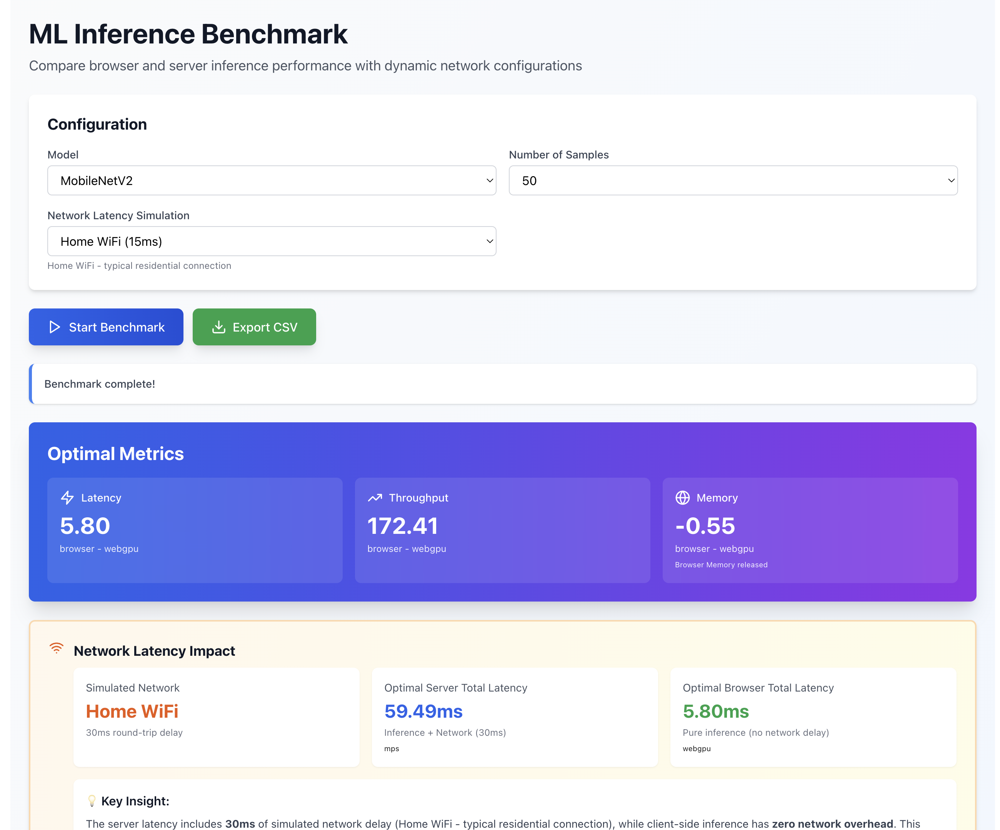

# ML Inference Benchmark - React App

A modern, modular React TypeScript application for benchmarking ML model inference performance on browser and server with dynamic network RTT configuration.

## 🎯 Key Features

✅ **Modular Architecture** - Clean separation of concerns with React components, hooks, and utilities  
✅ **TypeScript Support** - Full type safety throughout the application  
✅ **Tailwind CSS** - Modern, responsive styling with utility-first approach  
✅ **Vite** - Lightning-fast build tool and development server  
✅ **Dynamic Network RTT** - ENUM-based network RTT selection (LAN, HOME_WIFI, 4G, 5G, SATELLITE)  
✅ **Browser & Server Inference** - Benchmark both local and remote execution  
✅ **Comprehensive Metrics** - Accuracy, efficiency, UX, and network metrics

## 📁 Project Structure

```
ml-inference-benchmark/
├── src/
│   ├── components/
│   │   ├── BenchmarkForm.tsx           # Main form for benchmark configuration
│   │   ├── ComparisonChart.tsx         # Orchetration of Form & result
│   │   ├── ResultsDisplay.tsx          # Results visualization component
│   │   ├── PerformanceComparison.tsx   # Main metric of result
│   │   └── NetworkLatencyInfo.tsx      # Network configuration UI
│   ├── hooks/
│   │   └── useBenchmark.ts             # Benchmark state management hook
│   ├── types/
│   │   ├── benchmark.ts                # TypeScript interfaces for benchmarks
│   │   └── network.ts                  # NetworkRTT ENUM and types
│   ├── utils/
│   │   ├── constants.ts                # Model, optimization, sample constants
│   │   ├── inference.ts                # ONNX inference engine
│   │   ├── benchmark.ts                # Benchmark runners (browser & server)
│   │   ├── metrics.ts                  # Sub-Metrics computation utilities
│   │   ├── metricsCalculator.ts        # Overall Metrics computation utilities
│   │   └── testDataGenerator.ts        # Test data loading utilities
│   ├── App.tsx                         # Main app component
│   ├── main.tsx                        # React DOM entry point
│   └── index.css                       # Tailwind CSS + custom styles
├── public/
│   ├── models/                     # ONNX model files
│   └── data/                       # Test data (CIFAR-10, AG News)
├── vite.config.ts                  # Vite configuration
├── tsconfig.json                   # TypeScript configuration
├── tailwind.config.js              # Tailwind CSS configuration
├── postcss.config.js               # PostCSS configuration
├── package.json                    # Dependencies and scripts
├── index.html                      # HTML entry point
└── README.md                       # This file
```

## 🚀 Quick Start

### Prerequisites

- Node.js 16+ and npm

### Installation

1. **Install dependencies**

```bash
npm install
```

3. **Set up model and data files**

- Populate [model](./public/models/)
- Populate [tokens](./public/models/local-tokenizer-agnews/)
- Populate [data](./public/data/cifar10/)

4. **Start development server**

```bash
npm run dev
```

The application will open at `http://localhost:5173`

## 📊 Metrics Computed

### Accuracy Metrics

- **Precision** - TP / (TP + FP)
- **Recall** - TP / (TP + FN)
- **F1 Score** - Harmonic mean of precision and recall
- **ROC-AUC** - Area under ROC curve for multi-class classification

### Efficiency Metrics

- **Latency** - Min, Max, Avg, Median, P95, P99, Std Dev
- **Throughput** - Samples per second
- **Memory** - Peak and average usage
- **CPU Utilization** - Percentage

### UX Metrics

- **Responsiveness Score** - Combined latency + FPS score
- **Frame Smoothness** - UI smooth score
- **Frame Drops** - Count of dropped frames
- **Jitter** - Standard deviation of latencies

### Network Metrics (Server only)

- **RTT** - Round-trip time based on selected network type
- **API Latency** - Total request + response time
- **Overhead** - Serialization and other overhead

## 📈 Supported Models

- **MobileNetV2** - Efficient vision model (10 classes)
- **ResNet20** - Compact CNN (10 classes)
- **DistilBERT** - Fast NLP model (4 classes - AG News)

## ⚙️ Supported Optimizations

- **None** - CPU only
- **WebGL** - GPU acceleration via WebGL
- **WebGPU** - Next-gen GPU acceleration
- **WASM SIMD** - SIMD optimized WebAssembly
- **WebNN** - Browser native neural network API

## 📝 Configuration Files

### `vite.config.ts`

```typescript
- Port: 5173
- Auto-open browser
- ES2020 target
- Terser minification
```

### `tsconfig.json`

- Strict mode enabled
- Path aliases for imports
- JSX React 18 support

### `tailwind.config.js`

- Extended color palette
- Custom spacing scale
- Border radius utilities
- TailwindCSS Forms plugin

## 🌐 API Endpoint (Server)

The server benchmark expects:

**Endpoint:** `POST /api/benchmark`

**Request:**

```json
{
  "model_name": "mobilenetv2",
  "num_samples": 50,
  "optimization": "none",
  "network_rtt_ms": 30
}
```

**Response:**

```json
{
  "model": "mobilenetv2",
  "platform": "server",
  "optimization": "none",
  "accuracy": { ... },
  "efficiency": { ... },
  "ux": { ... },
  "network": { ... },
  "metadata": { ... }
}
```

## 🐛 Troubleshooting

### Models not loading

- Ensure ONNX model files are in `public/models/`
- Check browser console for fetch errors
- Verify CORS headers if models are remote

### Data not loading

- Ensure test data is in `public/data/`
- Check data path configuration in `testDataGenerator.ts`
- Verify CORS for remote data sources

### Performance issues

- Clear browser cache
- Disable browser extensions
- Use Chrome DevTools Performance tab for profiling
- Ensure adequate system resources for large sample counts

### TypeScript errors

```bash
npm run type-check  # Check for TypeScript errors
```

## Result



## Server Dependency project

https://github.com/VinodLouis/server-inference-traditional
